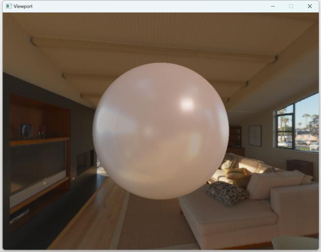

# RGS (C++ 开发的 Win32 软件光栅渲染器)

### 介绍

RGS 是一个在 Win32 下使用 C++ 开发的软件光栅渲染器。该光栅器指向两个不同的版本，其中一个为公益性的渲染管线学习项目，配备有[完整的视频讲解](https://www.bilibili.com/video/BV1bH4y1L75Q/)；而另外一个则是在学习版的项目上迭代而来的个人兴趣项目，该项目比学习版更加庞大，但不提供教学支持

 - [学习版](https://www.bilibili.com/video/BV1bH4y1L75Q/)实现了简单的**光栅化渲染管线**（顶点装配->顶点着色器->图元组装->光栅化->片段着色器）、**Blinn-Phong 光照模型**、**可自定义着色器**以及一些相关杂项（帧缓存、基于 stb_image 的材质、相机、模型加载、自建数学库和基于 Win32 的窗口管理）
 - 完整版则在学习版基础上添加简单的 **JobSystem** 以极大地提高渲染速度、**抗走样（MSAA）**、**PBR 渲染模型**、**PBR 相关预计算**、基于 ImGui 的控制窗口、层管理以及**简单的 RenderCommand && Pipeline**

> 完整版项目仍需完善补充，未来将持续更新

### 效果


### 快速开始

- 测试环境

```
CPU: AMD R7-7840HS

操作系统：Windows-11

编译器：MSVC, Clang
```

- 快速开始

```
git clone https://github.com/seehours/rgs
cd rgs
mkdir build
cd build
cmake ..
cmake --build
# 然后点击 RGS.exe 运行
```

### 效果

- PBR 球体渲染  

<div align=center>
   
  	
</div>

<div align=center>
   
   
</div>
  
- Blinn-Phong 模型
<div align=center>
   
</div>

- Job System 提速（右侧 8 fps -> 67 fps）
<div align=center>
   
</div>
<div align=center>
   
</div>

- MSAA 抗走样
<div align=center>
   
</div>


### 最后
 - [zauonlok](https://github.com/zauonlok) 的 [渲染器](https://github.com/zauonlok/renderer)（A shader-based software renderer written from scratch in C89）
 - [LearnOpenGL：权威的 OpenGL 理论指导](https://learnopengl-cn.github.io/)
 - [星河滚烫兮](https://space.bilibili.com/524338786) 编写的 [类似项目](https://github.com/1229282331/openrenderer.git)，以及其 [介绍视频](https://www.bilibili.com/video/BV1vwYdeREEG)